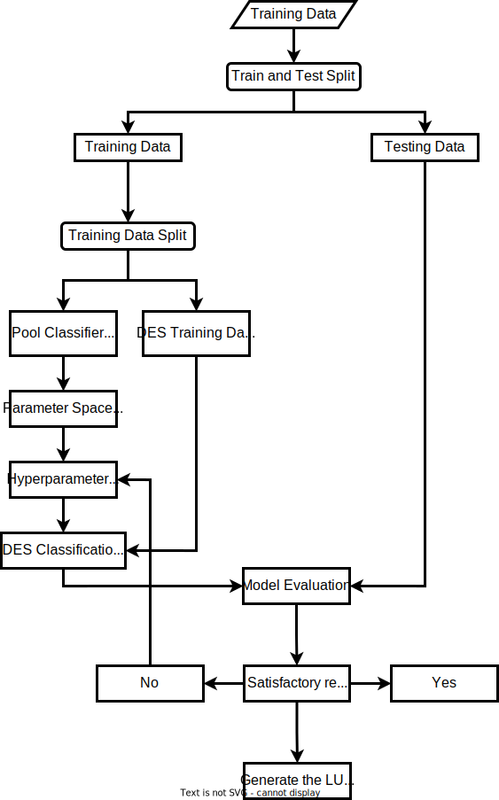

# Example of Dynamic Ensemble Classifiers for Land Use Land Cover Classification
## Introduction
Ensemble learning methods can be categorize into two main approaches, static and dynamic approach (H. Lu, Su, Hu, et al., 2022). The static method relied on single base classifiers, as discuss in the previous algorithms. The dynamic methods, or often refer as Dynamic Ensemble Selection (DES), select the base classifier on the fly according to new sample to be classified (Cruz et al., 2018; H. Lu, Su, Zheng, et al., 2022). The underlying rationale of DES is that each base classifier demonstrates expertise in specific local regions of the feature space (Cruz et al., 2020). Therefore, combining these "local experts" can enhance overall classification accuracy. 
## K-Nearest Neighbors Orcale
Ko et al (2008) introduced a novel DES-based selection process called K-Nearest Neighbor Oracles (KNORA). This method uses selection K nearest neighbor validation set, figure out which classifier correctly classified those neighbors and uses them as the ensemble for classifying the given pattern. Two KNORA framework were introduce in Ko et al (2008), KNORA-Union and KNORA-Eliminate. The KNORA-U employs a union rule, aggregating predictions from classifiers that correctly classify at least one instance within the local region (Elmi et al., 2023). In contrast, KNORA-E adopts a stricter criterion, selecting only classifiers that correctly classify all instances in the KNN set of the test sample. Implementation of DES for remote sensing image classification is found in Lu et al (2022) and Li et al (2022), with the application of detailed LULC mapping remains limited.
## Meta Learning for Dynamic Ensemble Selection
The selection of ensemble classifiers in dynamic ensemble selection (DES) is guided by estimates of the local accuracy or competence of base classifiers within a small region of the feature space (Cruz et al., 2014). In the KNORA framework, classifiers are selected based on their performance within the k-nearest neighbors of the query instance, with the aim of identifying the most competent classifiers in the local neighborhood. However, relying upon single criterion to measure level of competence of a base classifier is very prone to error (Cruz et al., 2014). To address this limitation, Cruz et al (2015) proposed a meta-learning framework for conducting the selection of the base classifiers. The meta learning perspective consider DES as a meta problem, in which different criteria is used to measure the level of competence for each base classifier. These criteria include various meta-features, such as measures of local accuracy in the region of competence, degree of confidence for the input sample, accuracy in the decision space, and etc (Cruz et al., 2015)
## Workflow
The implementation of Dynamic Ensemble Selection (DES) can be conducted using Deslib python library:
<br>
[](https://deslib.readthedocs.io/en/latest/)
<br>
The approach for this implementation, is similar to general machine learning workflow, with one notable difference. After splitting the original training data, the partitioned training data is further split into the training data for pool and the DES classiers. This approach is recommended by the authors of DESLIB, in which the DES classifiers, should be conducted by using different dataset from the pool classifiers. The following figure shows the workflow for implementation of dynamic ensemble classifier
<p align="center">
  
</p>
## Implementation for Land Use Land Cover Classification

below are the step by step guide for conducting DES implementation using DESLIB library, and jupyter notebook approach:
<br>
[](KNORAU.ipynb)
[](https://mybinder.org/v2/gh/yourusername/yourrepo/main?filepath=KNORAU.ipynb)

### Key Code Sections from the Notebook

#### 1. Importing Raster Data
```python
#importing the raster data
raster_file = 'path/to/Landsat_Combine_Param_final.dat'
dataset = rasterio.open(raster_file)

# Inspect raster structure
L9_NS = dataset.read().transpose(1, 2, 0)  # Convert to (rows, cols, bands)
print(f"Raster shape: {L9_NS.shape}")  # Output: (1811, 1325, 21)
